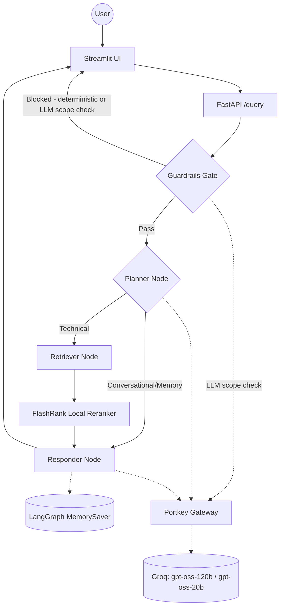

# Production RAG System with LLM Gateway & Custom Guardrails

A production-grade Retrieval-Augmented Generation system that answers technical documentation questions (Kubernetes, Intel hardware, enterprise networking), built around the operational concerns that separate a RAG demo from something you'd actually trust in production: a unified LLM gateway with automatic failover, a custom-engineered guardrails layer, full distributed tracing, and a real, quantitative evaluation suite, not just "it gives an answer."

## Demo

[](https://youtu.be/KPwb-5h6ZaY)

---

## Key Features

- **Multi-Agent RAG Pipeline**: LangGraph orchestrates a planner → retriever → responder flow, routing conversational questions to memory and technical questions to retrieval, with LangGraph's checkpointer providing per-thread conversation memory.
- **Unified LLM Gateway**: every LLM call in the app, main pipeline and guardrails alike, routes through a single Portkey gateway for automatic failover between primary/fallback Groq targets, response caching, and centralized cost/usage observability. No call bypasses it.
- **Custom Guardrails**: a hybrid gate combining instant deterministic phrase-matching (greeting, farewell, capabilities, jailbreak) with a single LLM-based scope classifier for open-ended off-topic detection, engineered after diagnosing a reliability failure in NeMo Guardrails' approach against reasoning-capable LLMs.
- **Resilient Retrieval**: Qdrant vector search + FlashRank local cross-encoder reranking, with Gemini embeddings as primary and an automatic local `sentence-transformers` fallback if Gemini is unreachable or rate-limited, so retrieval degrades gracefully instead of failing outright.
- **Local Document Parsing**: PDF, HTML, TXT, DOCX, and PPTX parsed entirely on-device, no external OCR/parsing service dependency.
- **Full Observability**: distributed tracing via Pydantic Logfire spans the entire request lifecycle, covering the UI, backend, guardrails, retrieval, and every LLM call.
- **Quantitative Evaluation Suite**: a RAGAS-based, LLM-as-judge evaluation pipeline (6 metrics) plus a dedicated guardrails precision/recall harness, with a golden dataset built from the real underlying documentation, run via a 3-tab Streamlit demo, with results reproducible as a standalone script.

---

## Architecture



Every LLM-calling node routes through the same Portkey gateway, deliberately, so cost tracking, failover, and logs cover the whole app rather than just the "main" answer-generation path.

---

## Project Structure

```text
├── app/
│   ├── agents/
│   │   └── nodes/       # Planner, Retriever, Responder LangGraph nodes
│   ├── gateway/         # Portkey LLM gateway: single factory for every LLM call in the app
│   ├── guardrails/      # Custom deterministic + LLM-based guardrails gate
│   ├── ingestion/
│   │   ├── chunking/    # Paragraph-based text splitter (1500 char target, hard-split on oversized paragraphs)
│   │   └── loaders/     # Local parsers: PDF, HTML, TXT, DOCX, PPTX
│   ├── services/
│   │   └── retrieval/   # Gemini embeddings (local fallback) + Qdrant search + FlashRank reranking
│   ├── config.py        # Centralized environment variable management
│   └── main.py          # FastAPI entrypoint: guardrails gate + /query endpoint
├── evals/                # RAGAS + guardrails evaluation suite, 3-tab Streamlit demo
├── testing/              # Standalone scripts to reproduce the full eval run outside Streamlit
├── ui/                   # Streamlit chat interface with reasoning-step transparency
└── requirements.txt      # Pinned dependencies
```

---

## Tech Stack

| Layer | Technology |
|-------|-----------|
| Orchestration | LangChain + LangGraph |
| LLMs | Groq (`openai/gpt-oss-120b` primary, `gpt-oss-20b` fallback) via **Portkey** gateway |
| Guardrails | Custom hybrid (deterministic phrase-matching + single LLM scope classifier) |
| Vector DB | Qdrant |
| Reranking | FlashRank (local cross-encoder, zero external latency) |
| Embeddings | Gemini `gemini-embedding-2-preview` (3072-dim), automatic local `sentence-transformers` fallback (768-dim) |
| Document Parsing | Local PDF/HTML/DOCX/PPTX parsing, no external OCR service |
| Observability | Pydantic Logfire (distributed tracing, UI → backend → LLM) |
| Evaluation | RAGAS (LLM-as-judge) + custom Tool Correctness (Jaccard) + guardrails precision/recall |

---

## Evaluation Results

Run against a golden dataset built from the real underlying documentation, using an LLM-as-judge methodology (RAGAS) with a dedicated, isolated judge API key so eval runs never compete with the production app's own rate limits:

| Metric | Score | What it measures |
|---|---|---|
| Faithfulness | 0.404 | Are the claims in the answer actually traceable to retrieved context? |
| Answer Relevancy | 0.803 | Is the answer relevant to what was actually asked? |
| Context Precision | 0.712 | Are the retrieved chunks actually relevant to the question? |
| Context Recall | 0.545 | Do the retrieved chunks contain enough info to support the reference answer? |
| Answer Correctness | 0.581 | How well does the answer match the reference answer? |
| Tool Correctness | 1.0 | Did the pipeline route to the correct handler (retrieval vs. memory vs. guardrails)? |

Guardrails precision/recall (adversarial + legitimate test cases): **1.0 / 1.0**, every jailbreak/off-topic attempt correctly blocked, every legitimate technical question correctly passed through.

Reproducible via `testing/run_phase2_only.py` against a captured `enriched_dataset.json`, or end-to-end via `testing/run_full_eval.py`.

---

## Getting Started

### 1. Install dependencies

```powershell
python -m venv .venv
.\.venv\Scripts\activate
pip install -r requirements.txt
```

### 2. Configure environment

Create a `.env` file (see `.env.example`):

```env
# Groq: primary + fallback keys, routed through Portkey
GROQ_API_KEY=""
GROQ_FALLBACK_API_KEY=""

# Portkey LLM Gateway
PORTKEY_API_KEY=""

# Qdrant Vector DB
QDRANT_API_KEY=""
QDRANT_CLUSTER_ENDPOINT=""          # e.g. https://your-cluster.cloud.qdrant.io:6333

# Pydantic Logfire Observability
LOGFIRE_TOKEN=""

# Streamlit UI → FastAPI
BACKEND_URL="http://localhost:8000"

# Eval judge LLM: kept separate from GROQ_API_KEY so eval runs never
# compete with the production app's own rate limits
JUDGE_GROQ=""

# Gemini Embeddings (falls back to local sentence-transformers if unset/unreachable)
GEMINI_API_KEY=""
```

### 3. Run data ingestion

Parses documents, chunks them, and indexes vectors into Qdrant.

```powershell
python -m app.ingestion.processor DATA --wipe
```

> `--wipe` drops and recreates the Qdrant collection. Omit it to append to an existing one.

### 4. Launch the app

```powershell
# Terminal 1: FastAPI backend
uvicorn app.main:app --reload --port 8000

# Terminal 2: Streamlit UI
streamlit run ui/app.py
```

### 5. Run the evaluation suite (optional)

```powershell
# Requires the FastAPI backend running on :8000
streamlit run evals/app.py
```

---

## Notable Engineering Decisions

A few things worth knowing if you're reading this as more than a quickstart:

- **The guardrails layer isn't the original approach.** It started as NeMo Guardrails and was rebuilt after tracing a real reliability failure in how its classification method interacts with reasoning-capable LLMs, happy to walk through the specifics.
- **The LLM-as-judge extraction path required its own fix.** Groq's `gpt-oss` models are unreliable with the forced tool-calling mode the evaluation library defaults to; switching extraction strategy took structured-output success from under 50% to over 90% in testing.
- **Every LLM call goes through the same gateway on purpose**, including the guardrails check. A call that bypasses centralized routing is invisible to cost tracking and failover, which defeats the point of having a gateway at all.

---

*A learning-driven build focused on the operational reality of running RAG in production, not just the retrieval-and-generate happy path.*
